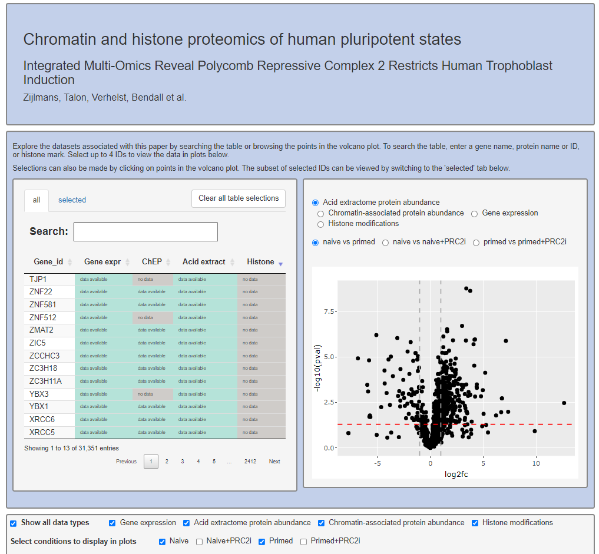

# Chromatin and histone proteomics of human pluripotent states

Shiny application that allows the exploration of datasets associated with the paper *Integrated Multi-Omics Reveal Polycomb Repressive Complex 2 Restricts Human Trophoblast Induction*.   

The app is hosted [here](https://www.bioinformatics.babraham.ac.uk/shiny/shiny_omics/Shiny_omics/). 

